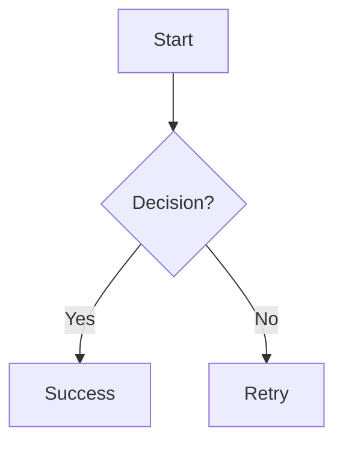

# SnapCode

<div align="center">

[](https://opensource.org/licenses/MIT)
[](CONTRIBUTING.md)
[](https://github.com/sandikodev/snapcode)

> **ngode-ngide kode ngadi-ngadi**

Create beautiful images of your markdown with authentic OS window simulations, Fira Code ligatures, Mermaid diagrams, and KaTeX math formulas.

🌐 **Live Demo:** [sandikodev.github.io/snapcode](https://sandikodev.github.io/snapcode)

[Features](#-features) • [Quick Start](#-quick-start) • [Contributing](CONTRIBUTING.md) • [License](#-license)

</div>

---

## 💫 A 10-Year Celebration

**This project celebrates 10 years (2016-2026) in Computer Science, specializing in Web Technology.**

A journey of passion, persistence, and pure love for the craft—distilled into a comprehensive learning resource.

From SMK to 10 years of experience. From dropout to DevOps engineer. From struggle to mastery.

**Not for profit, but for passion. Not for certificates, but for knowledge.**

📖 [Read the full journey](JOURNEY.md)

---

## ⚡ Quick Start - No Installation Required!

```bash
# Just open in browser - that's it!
open index.html
```

**No npm, no build, no server needed!** Pure client-side rendering.

> 💡 **Note:** Python server (`server.py`) is **OPTIONAL** - only for learning dynamic file loading.  
> The main app works 100% in browser without any server!

---

## ✨ Features

### 🖼️ OS Window Simulations
- **macOS Sequoia** - Latest macOS with gradient backdrop blur
- **macOS Ventura** - Classic macOS with traffic lights
- **Windows 11** - Modern rounded corners with centered controls
- **Windows 10** - Classic Windows with blue accent border
- **Chrome OS** - Material Design with circular buttons

### 🎨 Themes
- **Dracula** - Dark purple-gray theme
- **Monokai** - Classic dark brown theme
- **GitHub** - Clean light theme with proper syntax colors
- **Nord** - Arctic blue-gray theme

### 💎 Advanced Features
- ✅ **Fira Code Ligatures** - Beautiful programming ligatures (=>, ===, !=, <=, etc)
- ✅ **Mermaid Diagrams** - Flowcharts, sequence diagrams, and more
- ✅ **KaTeX Math** - Inline and block mathematical formulas
- ✅ **Syntax Highlighting** - Powered by Prism.js
- ✅ **Custom Scrollbars** - OS-specific scrollbar styles
- ✅ **Watermark** - Customizable size and opacity
- ✅ **Drag & Drop** - Drop markdown files directly
- ✅ **Export PNG** - High-quality 2x resolution
- ✅ **Copy Image** - Copy to clipboard (Chrome/Edge)

---

## 🏗️ Architecture

**SnapCode is 100% CLIENT-SIDE!** No server required for main functionality.

### Core Philosophy
- ✅ **Buildless** - No npm, webpack, or build tools
- ✅ **Serverless** - Runs entirely in browser
- ✅ **Componentless** - No React/Vue/Svelte complexity
- ✅ **Single File** - Just 56KB HTML file
- ✅ **CDN Dependencies** - No node_modules bloat

### Development Tools (Optional)
While the app is buildless, we use **development utilities** for code quality:
- 🔍 **HTMLHint** - HTML validation and linting
- 🔧 **ESLint** - JavaScript linting with Alpine.js support
- 🎨 **Prettier** - Consistent code formatting
- ✅ **Custom Validator** - SnapCode-specific checks

> **Why?** Teaching beginners that professional development includes quality tools, even for static sites. These are **dev utilities**, not runtime dependencies.

### Python Server?
The `server.py` is **OPTIONAL** and only for:
- 📚 Learning dynamic file loading
- 📚 Backend/DevOps study case
- 📚 REST API concepts

**Main app works perfectly without it!**

📖 Read more: [ARCHITECTURE.md](ARCHITECTURE.md)

---

## 🚀 Quick Start

### Option 1: Use Online
Visit [sandikodev.github.io/snapcode](https://sandikodev.github.io/snapcode) and start creating!

### Option 2: Self-Host
```bash
# Clone or download index.html
# Open in browser - no build step required!
open index.html
```

That's it! No npm install, no build process, no dependencies to manage.

### Option 3: Development with Professional Tools (Recommended for Learning)
```bash
# Clone the repository
git clone https://github.com/sandikodev/snapcode.git
cd snapcode

# Install development utilities (linting, formatting, validation)
pnpm install

# Run quality checks
pnpm run check:main

# Open in browser
open index.html
```

> 💡 **Learning Note**: Even for static HTML projects, professional developers use quality tools. The `pnpm install` here installs **development utilities only** (not runtime dependencies). This teaches:
> - **Clean Development Environment** - Consistent code quality
> - **Professional Workflow** - Industry-standard tools from day one  
> - **Best Practices** - Linting, formatting, validation
> - **Tool Separation** - Dev tools ≠ Runtime dependencies
> 
> The app still runs 100% in browser without any build step!

📖 Read more: [LINTING.md](LINTING.md)

---

## 📖 Usage

### 1. Write Markdown
Type or paste your markdown content in the editor.

### 2. Customize
- Choose OS window style
- Select theme
- Adjust font size and padding
- Enable/disable Fira Code, Mermaid, KaTeX
- Add watermark

### 3. Export
- **Export PNG** - Download high-quality image
- **Copy Image** - Copy to clipboard (paste in Paint, Photoshop, etc)
- **Copy Text** - Copy markdown source

---

## 🎯 Examples

### Fira Code Ligatures
```javascript
const add = (a, b) => a + b;
if (x !== y && a >= b) {
  console.log("Beautiful!");
}
```

### Mermaid Diagrams


### KaTeX Math
Inline: $E = mc^2$

Block:
$$
x = \frac{-b \pm \sqrt{b^2 - 4ac}}{2a}
$$

---

## 🛠️ Tech Stack

### Core
- **Alpine.js** (15KB) - Reactive UI without build step
- **Tailwind CSS** (CDN) - Utility-first styling
- **Marked.js** - Markdown parsing
- **DOMPurify** - XSS protection

### Features
- **Prism.js** - Syntax highlighting
- **Mermaid.js** - Diagram rendering
- **KaTeX** - Math formula rendering
- **html2canvas** - PNG export
- **Fira Code** - Programming font with ligatures

### Architecture
- **Buildless** - No npm, no webpack, no vite
- **Single HTML file** - 52KB total
- **CDN-based** - All dependencies from CDN
- **Progressive Enhancement** - Works without JavaScript (basic markdown)

---

## 🎨 Customization

### Font Size
Range: 10-24px (default: 14px)

### Desktop Padding
Range: 32-128px (default: 32px)
Controls the space between window and desktop background.

### Watermark
- Custom text (default: @sandikodev)
- Size: 8-24px (default: 24px)
- Opacity: 10-100% (default: 30%)

### Filename
Custom filename displayed in window title bar (default: README.md)

---

## 🌟 Why SnapCode?

### vs Carbon.now.sh
- ✅ Markdown support (not just code)
- ✅ Mermaid diagrams
- ✅ KaTeX math formulas
- ✅ Multiple OS simulations
- ✅ Offline capable (single HTML file)
- ✅ Open source

### vs Screenshot Tools
- ✅ Authentic OS window simulations
- ✅ Syntax highlighting
- ✅ Customizable themes
- ✅ High-quality export
- ✅ No watermark (unless you want one)

---

## 📦 File Structure

```
sandikodev.github.io/snapcode/
├── index.html          # Complete app (52KB)
└── README.md          # This file
```

That's it! Single HTML file with everything included.

---

## 🔧 Development

### No Build Required
Just edit `index.html` and refresh browser.

### Technologies Used
- **Alpine.js** - Reactive state management
- **CSS-in-JS** - Dynamic theme styling
- **Template Literals** - Dynamic CSS generation
- **ES6+** - Modern JavaScript

### Code Structure
```javascript
// Alpine.js component
function app() {
  return {
    // Reactive state
    theme: 'dracula',
    fontSize: 14,
    
    // Computed properties
    get parsedMarkdown() { ... },
    get styles() { ... },
    
    // Methods
    exportImage() { ... },
    copyText() { ... }
  }
}
```

---

## 🤝 Contributing

**Contributions are welcome!** This is an open-source project built for the community.

### Ways to Contribute

- 🎨 **Features** - New OS themes, color themes, export formats
- 🐛 **Bug Fixes** - Browser compatibility, rendering issues
- 📝 **Documentation** - Improve clarity, add examples, translations
- 💡 **Ideas** - Suggest features, share use cases

### Quick Start

Since this is a single HTML file, contributing is easy:

1. **Fork** the repository
2. **Edit** `index.html` in your browser or editor
3. **Test** by opening in browser (no build needed!)
4. **Submit** a Pull Request

See [CONTRIBUTING.md](CONTRIBUTING.md) for detailed guidelines.

### Code of Conduct

We follow a [Code of Conduct](CODE_OF_CONDUCT.md) to ensure a welcoming environment for all contributors.

---

## 📝 License

MIT License - feel free to use for personal or commercial projects.

---

## 👨‍💻 Author

**@sandikodev**

- Website: [sandikodev.github.io/snapcode](https://sandikodev.github.io/snapcode)
- Twitter: [@sandikodev](https://twitter.com/sandikodev)

---

## 🙏 Credits

- **Alpine.js** - Caleb Porzio
- **Tailwind CSS** - Adam Wathan
- **Prism.js** - Lea Verou
- **Mermaid.js** - Knut Sveidqvist
- **KaTeX** - Khan Academy
- **Fira Code** - Nikita Prokopov

---

## 📊 Stats

- **File Size:** 52KB (single HTML file)
- **Dependencies:** 0 (all from CDN)
- **Build Time:** 0 seconds (buildless)
- **Load Time:** < 1 second
- **Browser Support:** Modern browsers (Chrome, Firefox, Safari, Edge)

---

## 🎯 Roadmap

- [ ] More OS themes (Ubuntu, Fedora)
- [ ] Custom color themes
- [ ] SVG export
- [ ] Share via URL
- [ ] Dark mode for UI
- [ ] Keyboard shortcuts
- [ ] More diagram types
- [ ] Animation support

---

## 💡 Use Cases

- 📚 **Documentation** - Beautiful code examples
- 🎓 **Education** - Teaching materials with diagrams
- 📱 **Social Media** - Share code snippets
- 📝 **Blog Posts** - Code screenshots
- 🎨 **Presentations** - Professional slides
- 📖 **Books** - Technical illustrations

---

## ⚡ Performance

- **First Load:** < 1s (with CDN cache)
- **Render Time:** < 100ms
- **Export Time:** 1-2s (depending on content)
- **Memory Usage:** < 50MB
- **Bundle Size:** 52KB (uncompressed)

---

## 🔒 Privacy

- ✅ No tracking
- ✅ No analytics
- ✅ No cookies
- ✅ No server-side processing
- ✅ Everything runs locally in your browser
- ✅ Your content never leaves your device

---

## 🌐 Browser Support

| Browser | Version | Status |
|---------|---------|--------|
| Chrome | 90+ | ✅ Full support |
| Firefox | 88+ | ✅ Full support |
| Safari | 14+ | ✅ Full support |
| Edge | 90+ | ✅ Full support |
| Opera | 76+ | ✅ Full support |

---

## 📞 Support

- 🐛 **Bug Reports:** [GitHub Issues](https://github.com/sandikodev/snapcode/issues)
- 💬 **Discussions:** [GitHub Discussions](https://github.com/sandikodev/snapcode/discussions)
- 📧 **Email:** hello@sandikodev.com
- 🐦 **Twitter:** [@sandikodev](https://twitter.com/sandikodev)

---

**Made with ❤️ by @sandikodev**

*ngode-ngide kode ngadi-ngadi* 🚀
