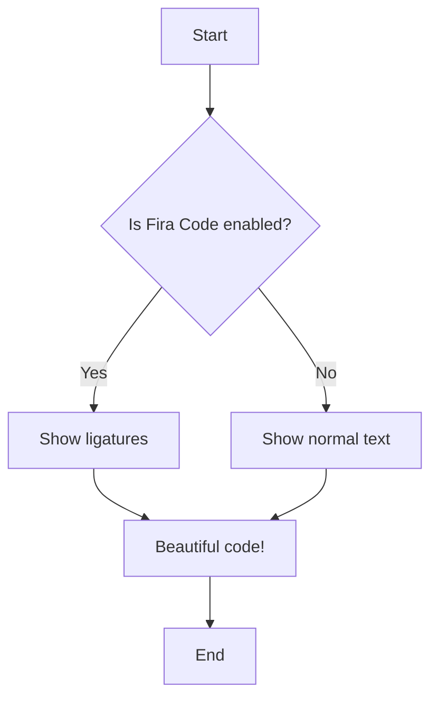
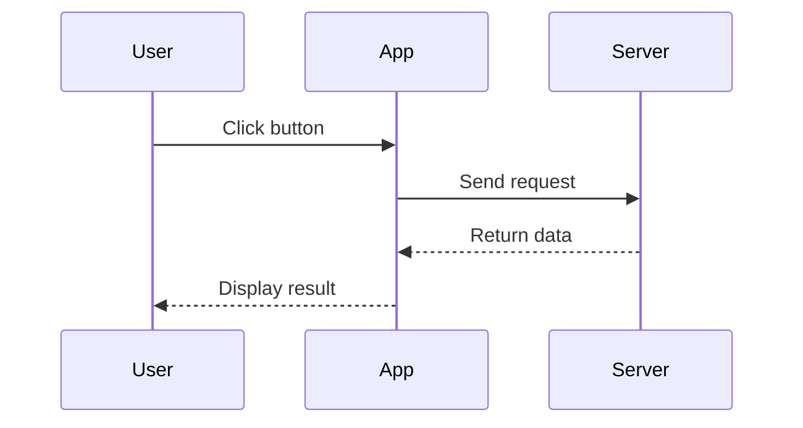

# Markdown Features Demo

## Fira Code Ligatures Test

When **Fira Code** is enabled, these will show as ligatures:

```javascript
// Arrow functions
const add = (a, b) => a + b;

// Comparisons
if (x !== y && a >= b) {
  console.log("Not equal!");
}

// Other ligatures
x === y
a <= b
a != b
<= >= == === !== !=
-> => ==> <=> <!-- -->
```

## KaTeX Math Formulas

### Inline Math
Einstein's famous equation: $E = mc^2$

Pythagorean theorem: $a^2 + b^2 = c^2$

### Block Math

Quadratic formula:
$$
x = \frac{-b \pm \sqrt{b^2 - 4ac}}{2a}
$$

Integral:
$$
\int_{0}^{\infty} e^{-x^2} dx = \frac{\sqrt{\pi}}{2}
$$

Summation:
$$
\sum_{i=1}^{n} i = \frac{n(n+1)}{2}
$$

Matrix:
$$
\begin{bmatrix}
a & b \\
c & d
\end{bmatrix}
$$

## Mermaid Flowchart



## Mermaid Sequence Diagram



## Code Syntax Highlighting

```python
def fibonacci(n):
    if n <= 1:
        return n
    return fibonacci(n-1) + fibonacci(n-2)

# Test
print(fibonacci(10))
```

## Table Example

| Feature | Status | Notes |
|---------|--------|-------|
| Ligatures | ✅ | Fira Code |
| Mermaid | ✅ | Diagrams |
| KaTeX | ✅ | Math formulas |
| Syntax | ✅ | Prism.js |

## Blockquote

> This is a sample markdown with **Fira Code ligatures**, **Mermaid diagrams**, and **KaTeX math formulas**.
> Try toggling the checkboxes to see the difference!

---

**Made with ❤️ by @sandikodev**
